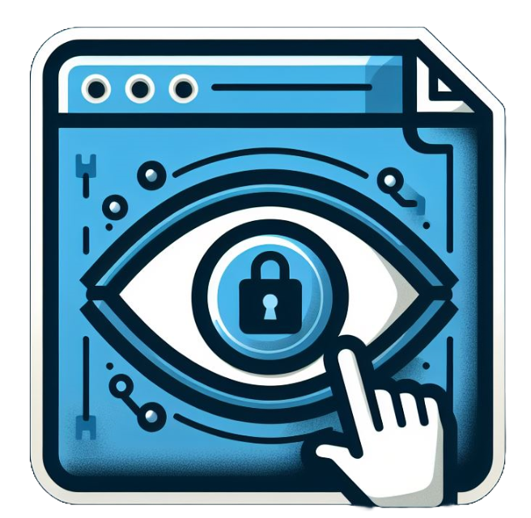

<h1>RichCrypter</h1>

<h2>Descrição</h2>

O RichCrypter é uma ferramenta simples e eficaz para a geração de chaves binárias únicas, que podem ser utilizadas para criptografar e proteger suas senhas salvas em arquivos txt. Com este programa, você pode fortalecer a segurança de suas informações confidenciais, garantindo que apenas quem possui a chave correspondente seja capaz de realizar a descriptografia.

Possui a versão em CLI e com interface gráfica.

<h2>Funcionalidades</h2>
<ul>
    <li>Gera chaves binárias únicas.</li>
    <li>Permite a criptografia de senhas em arquivos txt.</li>
    <li>Apenas quem possui a chave correspondente pode descriptografar os dados.</li>
</ul>

<h2>Como Usar</h2>
<ul>
    <li>Crie sua chave binária única clicando em "Generate Encryption Key"</li>
    <li><strong>Atenção:</strong> sua chave binária é única e deve ser protegida. Sem ela, será impossível descriptografar os arquivos.</li>
    <li>Salve seu texto(s) para criptografar em um arquivo .txt</li>
    <li>Clique em "Encrypt Files" e selecione o(s) arquivo .txt e a chave binária criada.</li>
    <li>Para descriptografar basta clicar em "Decrypt Files", selecionar a chave binária utilizada na criptografia e os arquivos .bin a serem descriptografados.</li>
    <li>Você pode salvar os arquivos descriptografados como .txt ou apenas mostrar a mensagem na tela sem salvar nenhum arquivo.</li>
</ul>

